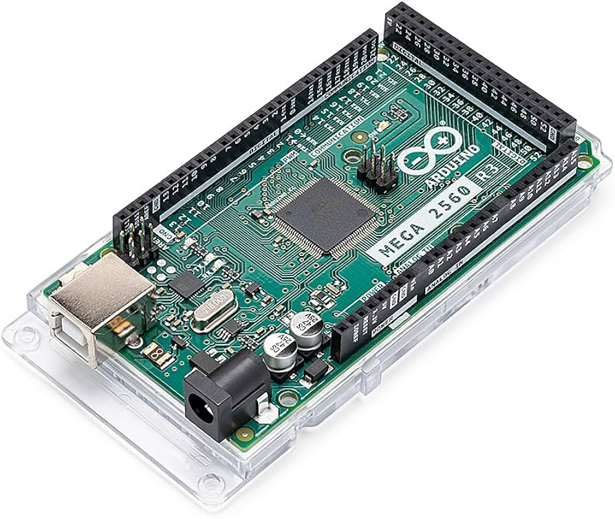
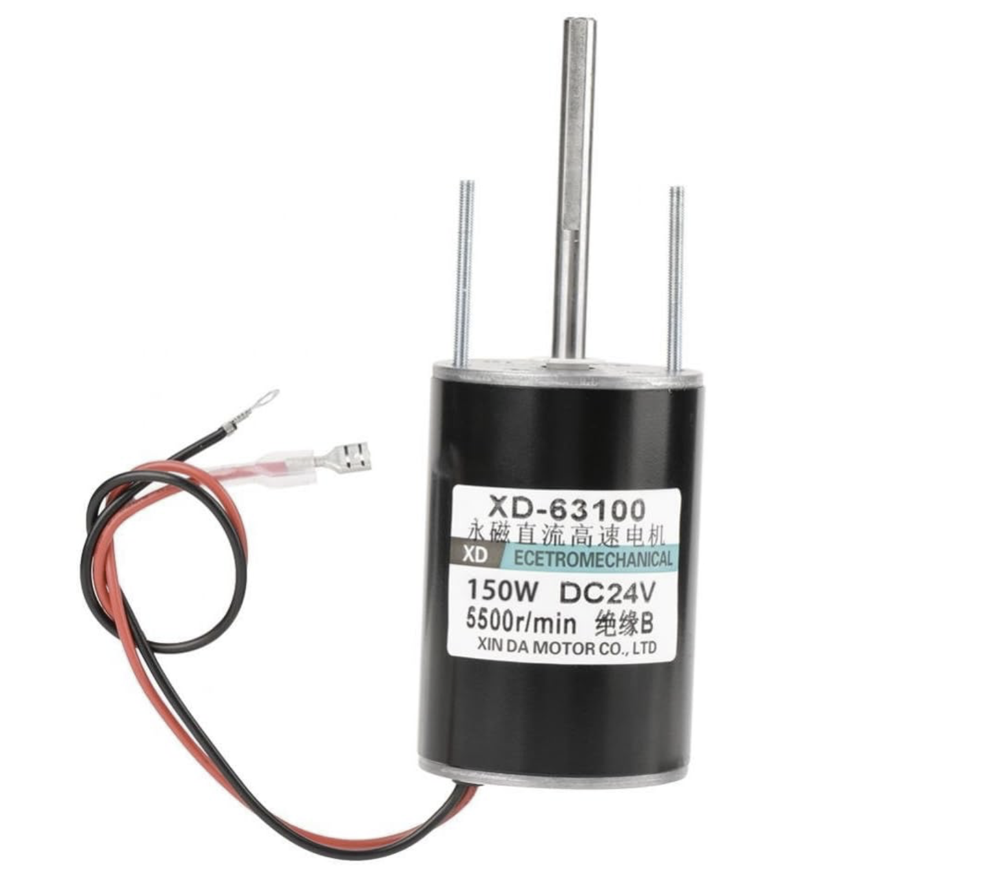
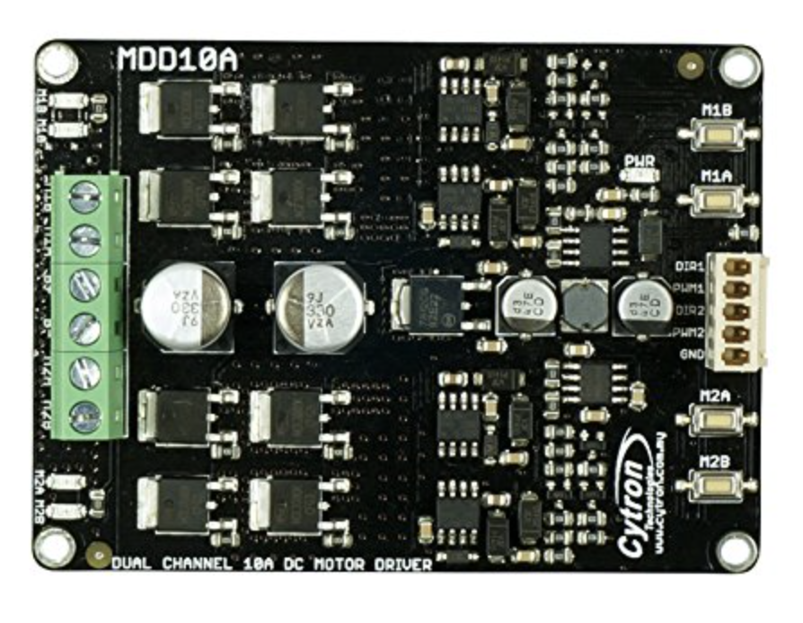
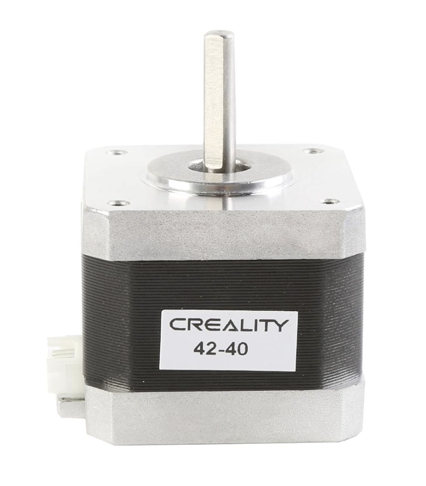
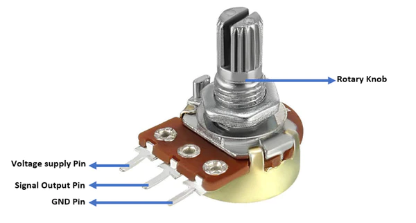

# 🎾 DIY Self-Made Tennis Ball Machine

## 🚀 Project Overview

This repository contains the code, general manufacturing steps, and an in-depth overview of the main electronic and mechanical components used in creating my own **DIY tennis ball feeding machine**. This README is not complete but is currently being worked on in oder to include all major components used and a general build guide of the project.  

> **Status:** ⏳ *Project is 75% complete* — still working on full automation of the feeding mechanism. **PICTURES AND VIDEOS OF THE MACHINE FUNCTIONING IN ITS CURRENT STATE WILL BE COMING SOON!**

⚠️ *This is not a step-by-step tutorial but rather a detailed reference guide for those looking to build their own machine!*

---

## 📖 Table of Contents

- [Why Did I Make This?](#-why-did-i-make-this)
- [Requirements](#-requirements)
- [Languages Used](#-languages-used)
- [List of Main Materials](#-list-of-main-materials)
  - [Electronics](#-electronics)
- [Tests](#-tests)
- [Next Steps](#-next-steps)
- [Future Improvements and Updates](#-future-improvements-and-updates)
- [Questions](#-questions)

---

## 🎯 Why Did I Make This?

As an avid tennis player, I am always looking for hitting partners and new ways to advance my abilities on the court. Ball machines are a great tool, as they allow you to recreate just about any shot and practice it over and over again. This was my primary motivation for building my own.

### So why not just buy one?

Sure, purchasing a professionally built, high-quality machine is the simplest solution—until you see the **$1,200+** price tag! Plus, buying a machine and calling it quits does little to fullfil my consistent, unexplainable, and rather enigmatic desire to take on extensive projects I have little to absolutely no experience with. This challenge felt like the perfect opportunity to merge my love for **software & microcontroller development, engineering, and tennis**.

💡 If you're considering making your own machine, be aware that this project requires **mechanical, fabrication, electrical, and programming knowledge**, along with a variety of power tools. It is not for the faint of heart. However, if you're up for the challenge, I hope this README serves as a valuable reference but it will not be a step by step build guide. A more in-depth video showing and explaining the build will be coming soon and I am more than happy to answer any question and help how I can if you do decide to build your own ball machine. 

---

## 🔧 Requirements

To ensure this project is worth the effort, my DIY ball machine needed to meet the following requirements:

✅ **Ball Spin Control** — Ability to apply **topspin or backspin** via two independently controlled throwing wheels.  
✅ **Throwing Speed** — Must be capable of launching balls at **60+ mph**.  
✅ **Adjustable Throwing Angle** — Flexibility to modify shot trajectory.  
✅ **Portability** — Compact and lightweight enough for easy transport.  
✅ **Battery Powered** — With optional AC power support.  
✅ **Auto Feeding** — Large holding capacity with an **adjustable BPM (Balls Per Minute)** setting.  

---

## 🖥️ Languages Used

- **C++** *(currently used for microcontroller programming)*
- Future improvements will include **Python & JavaScript** for UI and automation enhancements.

---

## 🛠️ List of Main Materials

### 🔌 Electronics

| Component | Image | Purpose |
|-----------|-------|---------|
| **Arduino Mega R3 2560** |  | - Chosen for its numerous **I/O ports**, essential for motor and sensor control.    - Supports **PWM signals**, crucial for motor speed adjustments.    - Compatible with various expansion modules for future upgrades. |
| **(2) 150W 24V, 5500RPM PMDC Motors** |  | - High **RPM** ensures the machine can launch balls at **60+ mph**.    - **Permanent magnet design** provides consistent performance.    - Selected for optimal balance between power and energy efficiency.    - ⚠️ *Note: Beyond the motor's total power capabilities and RPMs, the rated **Stall Current** of the motors need to be considered!* |
| **MDD10A Cytron Dual-Channel Motor Driver** |  | - Controls both throwing motors independently.    - Supplies up to **10 Amps at 30 Volts per channel.**   - Supports **bidirectional control**, allowing for spin variations.    - Uses **PWM signals** to regulate motor speed efficiently. |
| **Nema 17 Stepper Motor** |  | - Stepper motor used for adjusting ball throwing angle.    - Chosen for its **Accuracy, Low power, Smooth Speed, Stable Performance.**    - Motor was repurposed from a non-functioning 3D printer. | 
| **B10K Potentiometers 10K ohm** |  | - Used for controlling speed of each throwing wheel.    - In the machines current form, these also control ball spin by simply speeding up/slowing down 1 wheel. 

### 🔩 Mechanical Components

While the full hardware list is still being finalized, key materials include:

- **Custom-built frame** (Aluminum & 3D-printed parts)
- **Adjustable ball chute** for varied shot angles
- **High-grip rubber throwing wheels** for improved ball control

🔹 *A more detailed parts list will be added as the project nears completion.*

---

## 🛠️ Tests

Throughout the build, I have conducted multiple tests, including:

🔹 **Motor Speed Tests** — Ensuring the motors provide sufficient RPM and torque.  
🔹 **Ball Launching Consistency** — Measuring shot accuracy and repeatability.  
🔹 **Power Consumption Analysis** — Evaluating battery life and system efficiency.  

---

## 🚀 Next Steps

🔹 Fine-tuning the **ball feeding mechanism** for smoother operation.  
🔹 Enhancing **user interface** by adding a touchscreen for modern controls.  
🔹 Improving **portability features** for easier transport.  

---

## 🔮 Future Improvements and Updates

🚀 **Bluetooth & WiFi Control** — Implementing a mobile app for remote control and settings adjustment.  
🚀 **Machine Learning Integration** — Allowing adaptive shot speed and trajectory adjustments based on play style.  
🚀 **Automated Drills** — Pre-programmed shot sequences for customized training sessions.  

---

## ❓ Questions

If you have any questions, suggestions, or want to collaborate, feel free to open an issue or reach out!

📩 **Contact:** [Your Email / GitHub Profile]

